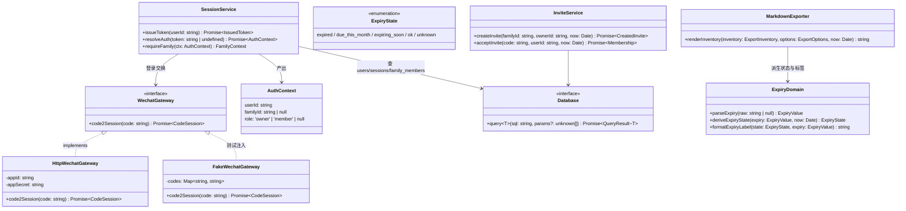
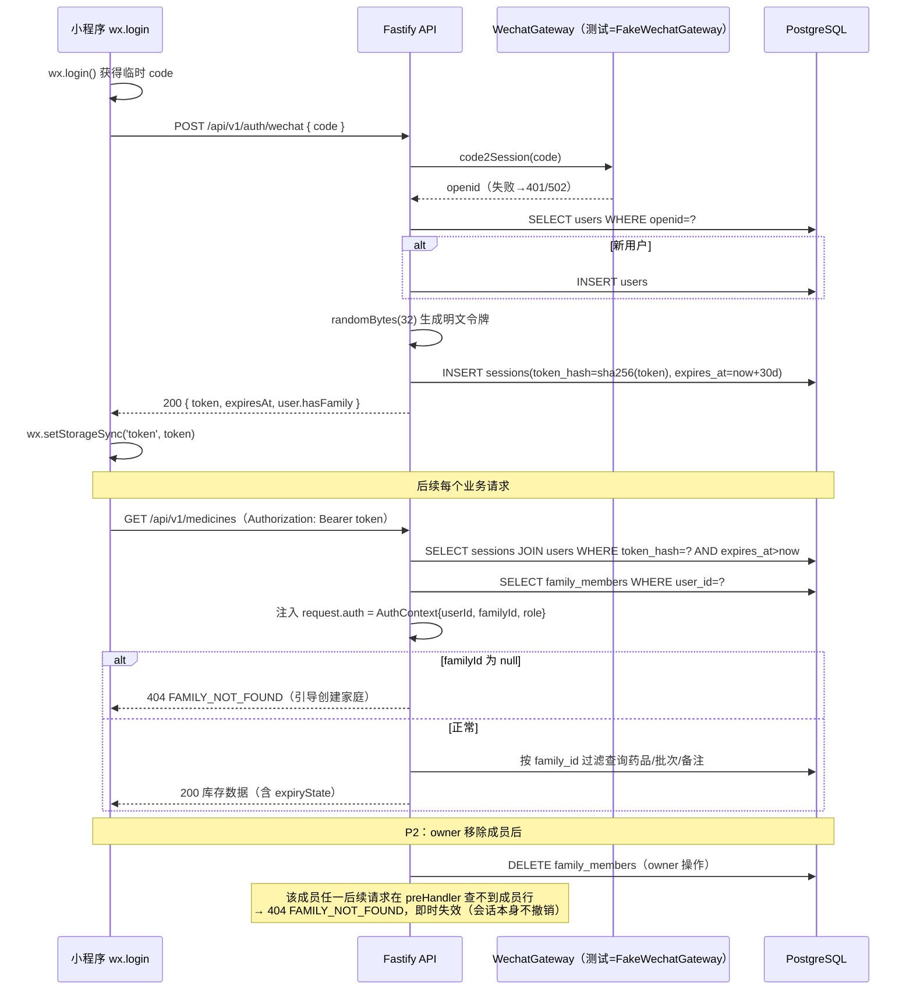

# 家庭药箱 MVP 系统设计（P1 手动录入＋导出 → P2 家庭共享）

- 日期：2026-09-24
- 作者：架构师 高见远（Gao）
- 上游权威：`tasks/plans/2026-09-24-mvp-roadmap.md`、`docs/product/prd-mvp-2026-09-24.md`。本文档不推翻任何已定决策。
- 范围：仅本轮 MVP（roadmap P1 + P2 的代码与合成测试）。P3 拍照识别、P4 上线试用不在本文档范围。

---

## 0. 主理人临时决策（D1–D4，待 Jovi 确认）

| 编号 | 决策 | 内容 | 影响 |
|------|------|------|------|
| D1 | 导出包含存放位置 | `POST /api/v1/exports/markdown` 输出中包含批次的 `storageLocation`（未知则标注"存放位置未记录"） | 导出渲染器多一个字段；`MedicationBatchSummary` 已含 `storageLocation`，contracts 无需改 |
| D2 | 邀请形态 = 文本邀请码 | owner 生成一次性文本邀请码，家人在小程序输入框粘贴后加入；不做二维码/链接 | `invitations` 表存哈希即可；小程序加一个输入入口，无需扫码/深链能力 |
| D3 | 本轮不提供成员自助退出 | 用户更换家庭只能由 owner 移除；自助退出进 backlog | 不实现 `DELETE /api/v1/families/members/self`；文档与界面提示走 owner 移除路径 |
| D4 | 归档药品不进默认导出 | `includeArchived` 默认 `false`；显式传 `true` 时归档药品以"（已归档）"标注分区输出 | 导出请求体加 `includeArchived?: boolean` |

> 以上四项如 Jovi 推翻，改动范围仅限：导出请求体/渲染器（D1、D4）、邀请入口交互（D2）、新增自助退出端点（D3），不影响数据库主结构。

---

## 1. 实现要点与技术选型

### 1.1 核心难点

1. **有效期精度算法**：`YYYY-MM-DD` / `YYYY-MM` / 未知 三种精度，"年月只显示月份、过月才过期、当月标本月到期、到日提前 30 天临期"。这是纯函数问题，抽到 `src/domain/expiry.ts` 用注入时钟测试（月末/跨年边界）。
2. **并发控制（整数版本 → 409）**：药品与批次均带 `version` 列，更新走 `UPDATE ... WHERE id=$1 AND version=$2`，`rowCount=0` 时区分"记录不存在"与"版本冲突"（先 SELECT 归属再判定，返回 404 或 409）。
3. **会话与成员关系校验**：每个读写端点都要"会话 → 用户 → 家庭成员关系"三步校验。用 Fastify `preHandler` 统一注入 `request.auth`（用户 + 成员身份），路由内只做归属比对，避免散落逻辑。
4. **微信登录可测试性**：定义 `WechatGateway` 接口（`code2Session(code)`），生产实现走 `https://api.weixin.qq.com/sns/jscode2session`（AppID/AppSecret 仅服务端环境变量读取），测试注入假网关；不提供公开测试登录接口。
5. **Markdown 导出**：渲染器为纯函数 `renderMarkdown(inventory, options, now) → string`，输入为已鉴权查询出的库存数据，输出显式标注未知/零/过期；用户内容必须做 Markdown/HTML 转义，防注入。
6. **邀请码一次性 + 72h**：明文邀请码只在创建响应出现一次，库存 sha256 哈希；接受时 `UPDATE ... WHERE token_hash=$1 AND used_at IS NULL AND expires_at > now()`，原子消费防复用。

### 1.2 选型（延续现有栈，不引入新框架）

| 关注点 | 选择 | 理由 |
|--------|------|------|
| HTTP 框架 | Fastify ^5（已有） | 现有 `buildServer` 合成注入模式已验证；schema 校验用其内置 JSON Schema 即可 |
| 数据库 | PostgreSQL + pg Pool（已有） | 迁移框架（`schema_migrations` + advisory lock + checksum）已就绪，只加 SQL 文件 |
| 令牌 | `node:crypto.randomBytes(32)` + sha256 哈希落库 | 无需 JWT 依赖；服务端可即时失效（成员移除后按会话查关系即失效） |
| 类型共享 | `packages/contracts` 扩展 | 前后端共用 `ExpiryValue`/`ExpiryState`/请求载荷类型 |
| 小程序 | 原生 TS 页面 + 自封装 `utils/request.ts` | 项目已是原生小程序；不引入云开发/第三方框架 |
| 架构模式 | 路由（routes）→ 仓储函数（repositories）→ 纯领域函数（domain） | 与现有 `routes/health.ts` 的扁平风格一致，从简，不引入 DI 容器 |

---

## 2. 数据库设计

### 2.1 `apps/api/db/migrations/002_core_inventory.sql`（DDL 草案）

```sql
-- P1 核心库存：用户、家庭、成员、会话、药品、批次、个人剂量备注。
-- 约定：数量 quantity NULL=未知，0=确定耗尽；有效期存原文 expiry_value + 精度 expiry_precision 两列。

CREATE TABLE users (
  id         uuid PRIMARY KEY DEFAULT gen_random_uuid(),
  openid     text NOT NULL UNIQUE,               -- 微信 openid，登录幂等键
  nickname   text,
  created_at timestamptz NOT NULL DEFAULT now(),
  updated_at timestamptz NOT NULL DEFAULT now()
);

CREATE TABLE families (
  id         uuid PRIMARY KEY DEFAULT gen_random_uuid(),
  name       text NOT NULL,
  created_by uuid NOT NULL REFERENCES users(id),
  created_at timestamptz NOT NULL DEFAULT now(),
  updated_at timestamptz NOT NULL DEFAULT now()
);

-- 每账号仅一个家庭：user_id 唯一约束即实现该不变量。
CREATE TABLE family_members (
  id        uuid PRIMARY KEY DEFAULT gen_random_uuid(),
  family_id uuid NOT NULL REFERENCES families(id) ON DELETE CASCADE,
  user_id   uuid NOT NULL UNIQUE REFERENCES users(id) ON DELETE CASCADE,
  role      text NOT NULL CHECK (role IN ('owner', 'member')),
  joined_at timestamptz NOT NULL DEFAULT now()
);
CREATE INDEX idx_family_members_family ON family_members(family_id);

-- 数据库只存令牌 sha256 哈希与过期时间；明文令牌仅在登录响应返回一次。
CREATE TABLE sessions (
  id         uuid PRIMARY KEY DEFAULT gen_random_uuid(),
  user_id    uuid NOT NULL REFERENCES users(id) ON DELETE CASCADE,
  token_hash char(64) NOT NULL UNIQUE,          -- sha256 hex
  expires_at timestamptz NOT NULL,
  created_at timestamptz NOT NULL DEFAULT now()
);
CREATE INDEX idx_sessions_expiry ON sessions(expires_at);

CREATE TABLE medicines (
  id               uuid PRIMARY KEY DEFAULT gen_random_uuid(),
  family_id        uuid NOT NULL REFERENCES families(id) ON DELETE CASCADE,
  name             text NOT NULL,
  specification    text,
  manufacturer     text,
  approval_number  text,
  active_ingredients jsonb NOT NULL DEFAULT '[]'::jsonb,   -- string[]
  purpose_category text,
  -- 说明书摘要（手填）：来源 + 核验状态，未核验不进默认导出
  leaflet_purpose_summary       text,
  leaflet_package_usage_summary text,
  leaflet_contraindications_summary text,
  leaflet_precautions_summary   text,
  leaflet_source     text,
  leaflet_review_status text NOT NULL DEFAULT 'unverified'
      CHECK (leaflet_review_status IN ('unverified', 'matched', 'user_confirmed')),
  is_archived   boolean NOT NULL DEFAULT false,       -- 归档 = 软删除（D4：默认不进导出）
  created_by    uuid NOT NULL REFERENCES users(id),
  updated_by    uuid NOT NULL REFERENCES users(id),
  updated_at    timestamptz NOT NULL DEFAULT now(),
  version       integer NOT NULL DEFAULT 1            -- 并发控制，PUT 不匹配返回 409
);
CREATE INDEX idx_medicines_family ON medicines(family_id) WHERE NOT is_archived;

-- 批次冗余 family_id：批次级端点可直接校验归属，避免逐级 join 判断。
CREATE TABLE medicine_batches (
  id            uuid PRIMARY KEY DEFAULT gen_random_uuid(),
  medicine_id   uuid NOT NULL REFERENCES medicines(id) ON DELETE CASCADE,
  family_id     uuid NOT NULL REFERENCES families(id) ON DELETE CASCADE,
  lot_number    text,
  expiry_value  text,                                  -- 原文：'2026-10-31' / '2026-10' / NULL
  expiry_precision text NOT NULL DEFAULT 'unknown'
      CHECK (expiry_precision IN ('day', 'month', 'unknown')),
  quantity      integer CHECK (quantity IS NULL OR quantity >= 0),  -- NULL=未知，0=耗尽
  unit          text NOT NULL DEFAULT 'other'
      CHECK (unit IN ('tablet', 'capsule', 'sachet', 'bottle', 'box', 'other')),
  -- 盒→片/袋换算数：仅经用户确认后填写，未经确认不用于任何换算展示
  confirmed_units_per_package integer
      CHECK (confirmed_units_per_package IS NULL OR confirmed_units_per_package > 0),
  storage_location text,
  created_by    uuid NOT NULL REFERENCES users(id),
  updated_by    uuid NOT NULL REFERENCES users(id),
  updated_at    timestamptz NOT NULL DEFAULT now(),
  version       integer NOT NULL DEFAULT 1
);
CREATE INDEX idx_batches_medicine ON medicine_batches(medicine_id);
CREATE INDEX idx_batches_family   ON medicine_batches(family_id);

-- 个人剂量备注：独立于药品通用说明；默认仅所属成员可见（visibility='private'）。
CREATE TABLE dosage_notes (
  id          uuid PRIMARY KEY DEFAULT gen_random_uuid(),
  family_id   uuid NOT NULL REFERENCES families(id) ON DELETE CASCADE,
  medicine_id uuid NOT NULL REFERENCES medicines(id) ON DELETE CASCADE,
  user_id     uuid NOT NULL REFERENCES users(id) ON DELETE CASCADE,  -- 备注所属成员
  content     text NOT NULL,                          -- 实际每日剂量等，纯手填
  visibility  text NOT NULL DEFAULT 'private' CHECK (visibility IN ('private', 'family')),
  created_by  uuid NOT NULL REFERENCES users(id),
  updated_by  uuid NOT NULL REFERENCES users(id),
  updated_at  timestamptz NOT NULL DEFAULT now(),
  version     integer NOT NULL DEFAULT 1
);
CREATE INDEX idx_notes_medicine_user ON dosage_notes(medicine_id, user_id);
```

### 2.2 `apps/api/db/migrations/003_family_invites.sql`（P2 批次，独立拆分）

```sql
-- P2 一次性邀请凭据（D2：文本邀请码）。明文只出现一次，库存 sha256；72 小时失效、一次性消费。
CREATE TABLE family_invites (
  id         uuid PRIMARY KEY DEFAULT gen_random_uuid(),
  family_id  uuid NOT NULL REFERENCES families(id) ON DELETE CASCADE,
  token_hash char(64) NOT NULL UNIQUE,
  created_by uuid NOT NULL REFERENCES users(id),     -- 仅 owner 可创建
  expires_at timestamptz NOT NULL,                   -- created_at + 72h
  used_at    timestamptz,                            -- 非空即已消费，不可复用
  used_by    uuid REFERENCES users(id),
  created_at timestamptz NOT NULL DEFAULT now()
);
CREATE INDEX idx_invites_family ON family_invites(family_id);
```

> 拆成 003 的原因：P2 可独立合入/回滚，且避免 P1 批次测试依赖 P2 表。

### 2.3 设计说明

- **有效期不存派生状态**：过期/本月到期/临期由 `domain/expiry.ts` 在读取时按 `now` 计算，改阈值不动数据。
- **归档**：药品 `is_archived` 软删除；批次 DELETE 为物理删除（批次录错即删，无引用）。
- **每账号一个家庭**：`family_members.user_id UNIQUE` 数据库级保证，创建第二家庭/接受邀请时服务端预检返回 409。
- **批量归属校验**：批次/备注冗余 `family_id`，端点用 `WHERE id=$1 AND family_id=$2` 单查询完成"存在 + 归属"判定。

---

## 3. API 端点设计

### 3.1 统一约定

- 认证：除 `POST /api/v1/auth/wechat` 与健康检查外，均需 `Authorization: Bearer <token>`。
- 错误响应统一 shape：

```json
{ "error": { "code": "VERSION_CONFLICT", "message": "记录已被他人修改，请刷新后重试" } }
```

| HTTP | 语义 | 典型 code |
|------|------|-----------|
| 400 | 请求体不合法 | `VALIDATION_ERROR` |
| 401 | 缺失/无效/过期令牌 | `UNAUTHORIZED` / `SESSION_EXPIRED` |
| 403 | 已认证但角色/权限不足（如非 owner 调邀请接口） | `FORBIDDEN` / `OWNER_ONLY` |
| 404 | 资源不存在，**含跨家庭访问**（不泄露其他家庭资源的存在性） | `NOT_FOUND` / `FAMILY_NOT_FOUND` |
| 409 | 版本冲突、已在家庭中、家庭名冲突等状态冲突 | `VERSION_CONFLICT` / `ALREADY_IN_FAMILY` |
| 410 | 邀请码已过期或已使用（语义化区分于 404） | `INVITATION_EXPIRED` / `INVITATION_USED` |
| 502 | 微信网关交换失败 | `WECHAT_GATEWAY_ERROR` |

> 401/403 边界：令牌问题一律 401；令牌有效但身份不满足（非 owner、移除自身、操作他人 private 备注）一律 403；跨家庭/不存在一律 404。

### 3.2 端点表

**认证**

| 方法/路径 | 请求 | 成功响应 | 错误 |
|-----------|------|----------|------|
| POST `/api/v1/auth/wechat` | `{ code: string }` | 200 `{ token, expiresAt, user: { id, hasFamily } }` | 400 code 缺失；401 `WECHAT_EXCHANGE_FAILED`（code 无效）；502 网关故障 |

- 服务端持 code 调 `WechatGateway.code2Session()` 换 openid；新 openid 建 `users`，否则复用。
- 生成 32 字节随机令牌，库存 sha256，有效期 30 天；每次登录新建会话（不轮换旧令牌）。
- `hasFamily` 供小程序决定跳"创建家庭"还是"药箱首页"。

**家庭**

| 方法/路径 | 请求 | 成功响应 | 错误 |
|-----------|------|----------|------|
| POST `/api/v1/families` | `{ name: string }` | 201 `{ family, membership(role:'owner') }`（事务内建家庭+owner 成员） | 400；401；409 `ALREADY_IN_FAMILY` |
| GET `/api/v1/families/current` | — | 200 `{ family, members: [{ id, role, joinedAt }] }`（无家庭 404 `FAMILY_NOT_FOUND`） | 401；404 |

**药品（家庭作用域；所有端点先经 auth preHandler 解析成员关系）**

| 方法/路径 | 请求 | 成功响应 | 错误 |
|-----------|------|----------|------|
| GET `/api/v1/medicines` | query: `includeArchived=false` | 200 `{ medicines: MedicineSummary[] }`（含批次与派生 `expiryState`） | 401；404 无家庭 |
| POST `/api/v1/medicines` | `CreateMedicineInput`（name 必填，其余可空，可带初始批次数组） | 201 `MedicationSummary`（version=1） | 400；401；404 |
| GET `/api/v1/medicines/{id}` | — | 200 `MedicationSummary` | 401；404（含跨家庭） |
| PUT `/api/v1/medicines/{id}` | `UpdateMedicineInput` = 字段 + `version` | 200 `MedicationSummary`（version+1） | 400；401；404；409 `VERSION_CONFLICT` |
| DELETE `/api/v1/medicines/{id}` | —（归档，软删除，不校验 version） | 204 | 401；404；幂等：已归档仍 204 |

**批次**

| 方法/路径 | 请求 | 成功响应 | 错误 |
|-----------|------|----------|------|
| GET `/api/v1/medicines/{id}/batches` | — | 200 `{ batches: MedicationBatchSummary[] }`（含派生 expiryState） | 401；404 |
| POST `/api/v1/medicines/{id}/batches` | `CreateBatchInput`（quantity 可 null=未知；expiry 需 value+precision 成对） | 201 `MedicationBatchSummary` | 400；401；404 |
| PUT `/api/v1/medicines/{id}/batches/{batchId}` | `UpdateBatchInput` + `version` | 200 `MedicationBatchSummary` | 400；401；404；409 |
| DELETE `/api/v1/medicines/{id}/batches/{batchId}` | — | 204（物理删除） | 401；404 |

**个人剂量备注**（可见性：本人全部可见；他人仅 `visibility='family'`）

| 方法/路径 | 请求 | 成功响应 | 错误 |
|-----------|------|----------|------|
| GET `/api/v1/medicines/{id}/dosage-notes` | — | 200 `{ notes: DosageNote[] }`（每人备注带 `userId`、`isMine`） | 401；404 |
| POST `/api/v1/medicines/{id}/dosage-notes` | `{ content, visibility?='private' }` | 201 `DosageNote` | 400；401；404 |
| PUT `/api/v1/medicines/{id}/dosage-notes/{noteId}` | `{ content?, visibility?, version }` | 200 `DosageNote` | 400；401；**404（他人的备注不可见即 404，含 private）；409** |
| DELETE `/api/v1/medicines/{id}/dosage-notes/{noteId}` | — | 204（仅本人可删自己的） | 401；404 |

**导出**

| 方法/路径 | 请求 | 成功响应 | 错误 |
|-----------|------|----------|------|
| POST `/api/v1/exports/markdown` | `{ includePersonalDosage?: boolean=false, includeArchived?: boolean=false(D4), includeStorageLocation?: boolean=true(D1) }` | 200 `{ markdown: string, generatedAt }`（`Content-Type: text/markdown; charset=utf-8`） | 401；404 无家庭 |

- 默认输出：全量未归档库存分区清单（按临期/过期/本月到期/正常/待补充分组）、批次、数量（未知/零显式标注）、有效期原文+精度标签、`user_confirmed` 的说明书摘要及来源；`unverified` 摘要仅标注"未核验"不冒充已确认资料。
- `includePersonalDosage=true` 时仅含当前用户有权查看的备注（本人全部 + 他人 family 可见），且逐条标注归属成员。
- 所有用户输入经 Markdown 转义（`|`、换行、`#`、`*`、`[` 等）。

**P2 家庭共享**

| 方法/路径 | 请求 | 成功响应 | 错误 |
|-----------|------|----------|------|
| POST `/api/v1/families/invitations` | — | 201 `{ invitationCode, expiresAt }`（明文仅此一次） | 401；403 `OWNER_ONLY` |
| POST `/api/v1/families/invitations/accept` | `{ code: string }` | 200 `{ family, membership }` | 401；404 无效码；409 `ALREADY_IN_FAMILY`；410 `INVITATION_EXPIRED`/`INVITATION_USED` |
| DELETE `/api/v1/families/members/{memberId}` | — | 204（成员行删除，其会话即时失去家庭数据访问） | 401；403（非 owner；或试图移除 owner/自己——owner 移除自己属 D3 backlog）；404 |

---

## 4. 类与接口设计（contracts 扩展 + 服务层）



contracts 扩展（`packages/contracts/src/index.ts` 追加，全部 camelCase、`XxxInput`/`XxxSummary` 命名）：

```ts
export type ExpiryState = "expired" | "due_this_month" | "expiring_soon" | "ok" | "unknown";
export interface ExpiryStateInfo { state: ExpiryState; label: string }
export interface DosageNoteSummary { id, medicineId, userId, isMine, content, visibility: "private"|"family", version }
export interface CreateMedicineInput / UpdateMedicineInput(version) / CreateBatchInput / UpdateBatchInput(version)
export interface FamilySummary { id, name, role, members: FamilyMemberSummary[] }
export interface MarkdownExportRequest { includePersonalDosage?: boolean; includeArchived?: boolean; includeStorageLocation?: boolean }
export interface MarkdownExportResponse { markdown: string; generatedAt: string }
export interface ApiError { error: { code: string; message: string } }
```

---

## 5. 认证与会话时序



---

## 6. 模块与文件清单

```
packages/contracts/src/index.ts                      [改] 追加 §4 类型
apps/api/src/
  types.ts                                           [新] Database 接口、AuthContext、错误码常量
  app.ts                                             [改] 注册新路由 + auth preHandler 装饰
  server.ts                                          [改] Database 注入改为 query(sql, params) 完整形态
  auth/wechat.ts                                     [新] WechatGateway 接口 + HttpWechatGateway + FakeWechatGateway
  auth/session.ts                                    [新] 令牌生成/哈希、resolveAuth、requireFamily preHandler
  domain/expiry.ts                                   [新] 有效期解析与状态算法（纯函数，注入 now）
  domain/markdown.ts                                 [新] 导出渲染器（纯函数 + 转义）
  repositories/users.ts / families.ts / medicines.ts
    / batches.ts / notes.ts / invites.ts             [新] 每文件一组按 family_id 过滤的查询函数
  routes/auth.ts / families.ts / medicines.ts
    / batches.ts / dosage-notes.ts / exports.ts / invitations.ts   [新]
apps/api/db/migrations/
  002_core_inventory.sql                             [新] §2.1
  003_family_invites.sql                             [新] §2.2（随 B3）
apps/api/test/
  helpers/fake-pool.mjs                              [新] 合成 query 记录/回放池（沿用现有注入模式）
  helpers/fake-wechat.mjs                            [新] 假微信网关注册
  auth.test.mjs / families.test.mjs / medicines.test.mjs
    / expiry.test.mjs / batches.test.mjs / notes.test.mjs
    / exports.test.mjs / invitations.test.mjs        [新]
apps/miniprogram/
  app.ts                                             [改] globalData 增加 token/apiBase
  app.json                                           [改] 注册新页面
  utils/request.ts                                   [新] 统一 wx.request 封装：Bearer 头、错误 shape 解析、401 跳登录
  services/api.ts                                    [新] 按端点封装 API 调用（登录/家庭/药品/批次/导出/邀请）
  pages/index/*                                      [改] 药箱首页：真实数据、临期/过期/本月到期/待补充区分计数
  pages/family-create/*                              [新] 创建家庭
  pages/medicine-edit/*                              [新] 手动录入/编辑药品（含说明书摘要+来源+"本人已核对"）
  pages/medicine-detail/*                            [新] 批次详情、数量未知/零、有效期精度、备注列表
  pages/export-preview/*                             [新] 导出预览、复制文本、写本地 .md + wx.shareFileMessage
  pages/invite/*                                     [新] P2：owner 生成邀请码 / 输入邀请码加入
.github/workflows/ci.yml                             [新] P0 收口：lint/typecheck/test/build，无任何密钥
tasks/plans/2026-09-24-mvp-roadmap.md（或台账所在文件）[改] 台账与 Git 现状、测试数量、阶段顺序对齐
```

---

## 7. 任务分解（3 个批次，按依赖排序）

### B1：后端核心（含 P0 收口） — 12 个文件，优先级 P0

- **内容**：`.github/workflows/ci.yml`（无密钥 CI：lint/typecheck/test/build）+ 台账对齐；`002_core_inventory.sql`；contracts 类型扩展；`types.ts`、`auth/*`、`repositories/users|families|medicines|batches|notes.ts`、`routes/auth|families|medicines|batches|dosage-notes.ts`、`domain/expiry.ts`；测试 `helpers/*`、`auth/families/medicines/batches/notes/expiry.test.mjs`。
- **依赖**：无（首个任务，基于现状）。
- **完成标准**：CI 五项（lint、typecheck、test、build + 台账核对）全绿；合成测试覆盖无家庭会话、跨家庭拒绝、409 冲突、同药多批次、数量未知/零、有效期算法（月末/跨年/年月精度）、备注可见性；`002` 迁移可重复执行（幂等 + checksum 校验既有机制生效）。

### B2：导出 + 小程序 — 11 个文件，优先级 P0

- **内容**：`domain/markdown.ts`、`routes/exports.ts`、`exports.test.mjs`（字段完整性、D1 存放位置、D4 归档排除、转义、includePersonalDosage 权限）；miniprogram `utils/request.ts`、`services/api.ts`、首页改造、`family-create`、`medicine-edit`、`medicine-detail`、`export-preview` 四个新页面 + `app.json`/`app.ts`/typings 更新。
- **依赖**：B1。
- **完成标准**：导出合成测试全过（含 Markdown 转义与个人剂量权限）；小程序 lint/typecheck 通过；`touristappid` 下页面可编译（编译证据可得时记录，缺失记 `PASS_CODE_ONLY`）；导出预览提供复制与 `wx.shareFileMessage` 两条路径。

### B3：P2 家庭共享 — 5 个文件，优先级 P1

- **内容**：`003_family_invites.sql`；`repositories/invites.ts`、`routes/invitations.ts`、`invitations.test.mjs`；miniprogram `pages/invite/*`。
- **依赖**：B1（B2 可并行，仅邀请页依赖 B2 的 request 封装，接口约定已在 contracts 冻结）。
- **完成标准**：邀请过期（410）、复用（410）、无效（404）、已有家庭拒绝（409）、owner 移除成员后即时失效（404）、非 owner 403 等场景合成测试全过；全仓 lint/typecheck/test/build 保持在 CI 绿。

**依赖关系**：`B1 → (B2, B3)`；B2 与 B3 相互独立可并行。

---

## 8. 测试策略

延续现有模式：`node:test` + `app.inject()` + 构造函数注入合成依赖。

1. **合成数据库（`fake-pool.mjs`）**：内存记录集 + 可编程查询结果；端到端走 HTTP 层，仓储 SQL 用参数化断言关键谓词（`family_id=$2`、`version=$2`、`token_hash`、`used_at IS NULL`）。
2. **假微信网关（`fake-wechat.mjs`）**：code→openid 映射注入；覆盖交换失败、重复登录幂等、令牌只存哈希。
3. **纯函数直测**：`expiry.test.mjs` 注入固定 `now` 覆盖月末（1/31、2/28）、跨年（2026-12→2027-01）、年月精度当月/过月、未知精度、提前 30 天边界（第 30/31 天）。
4. **覆盖清单（对应 roadmap P1.7 + P2.4 全部场景）**：
   - 无家庭会话访问业务端点 → 404 `FAMILY_NOT_FOUND`
   - 跨家庭访问药品/批次/备注 → 404（不泄露存在性）；非 owner 调邀请/移除 → 403
   - 过期算法：day/month/unknown 全分支 + 月末/跨年
   - 同药多批次：列表、独立版本号、批次级 409 不影响药品行
   - 数量：null=未知、0=耗尽，导出显式标注
   - 409：药品与批次并发编辑，查看最新值后重提成功
   - 导出：分区结构、有效期精度标签、已确认/未核验说明书区分、D1 存放位置、D4 归档排除、`includePersonalDosage` 默认 false、他人 private 备注不出现、Markdown 转义（`|`/换行/标题注入）
   - 邀请：过期/复用/无效/成功；已有家庭用户接受 → 409；owner 移除成员 → 该成员后续请求 404；移除 owner/自己 → 403/400
   - 备注：默认仅本人可见、family 可见他读不可改（PUT 他人备注 404）、导出遵守同权限
5. **真实环境项**：真实微信登录、真实 PostgreSQL 迁移、真机 `.md` 分享、两账号共享实测——环境缺失一律记 `PASS_CODE_ONLY`，不以合成结果替代。

---

## 9. 共享约定（工程师必读）

1. **错误 shape**：`{ error: { code, message } }`；message 面向用户可展示，不含内部细节（对齐现有 health 路由"日志留服务端"风格）。
2. **认证头**：`Authorization: Bearer <token>`；401 时小程序清除本地 token 并跳登录。
3. **contracts 命名**：类型全部 camelCase 字段；入参 `XxxInput`（更新类必含 `version: number`）、出参 `XxxSummary`；错误码常量入 `ApiErrorCode` 联合类型。
4. **日期工具签名**（`domain/expiry.ts`，前后端口径一致）：
   - `parseExpiry(raw: string | null): ExpiryValue` — 识别 `YYYY-MM-DD`/`YYYY-MM`，其余归 unknown
   - `deriveExpiryState(expiry: ExpiryValue, now: Date): ExpiryState` — day：`<now-30d` 过期、`[now-30d, now]` 临期；month：`<当月` 过期、`=当月` due_this_month；unknown → unknown
   - `formatExpiryLabel(state, expiry): string` — 中文标签（"已过期（2026-10）""本月到期""临期（剩 N 天）"等）
5. **迁移命名**：`NNN_snake_case.sql`，三位零填充数字前缀递增（002、003…），只增不改；`applyMigrations` 的 checksum 机制会拒绝篡改已应用文件。
6. **版本并发**：所有 PUT 必须携带 `version`；`UPDATE ... WHERE id AND version` 后 `rowCount=0` 时回查区分 404 与 409。
7. **隐私红线**：说明书 `reviewStatus !== 'user_confirmed'` 的内容不得进入默认导出的"已确认资料"区；剂量备注默认 `private`；任何用户输入进 Markdown 前必须转义。

---

## 转交工程师摘要

按 3 批次实施：B1 后端核心——新增 `002_core_inventory.sql`（users/families/family_members/sessions 存哈希/medicines/medicine_batches/dosage_notes，含 family_id、创建修改人、version 列）、contracts 扩展、WechatGateway 可注入登录、家庭/药品/批次/备注 CRUD（409 版本冲突）+ 无密钥 CI 与台账对齐；B2 导出与小程序——纯函数 Markdown 渲染器（D1 存放位置、D4 排除归档、转义）+ 首页/录入/批次详情/导出预览四页；B3 P2 共享——003 邀请表（哈希、72h、一次性）、邀请/接受/移除端点与邀请页。全部合成测试走 node:test + 假网关/假池；真实环境项记 PASS_CODE_ONLY。
