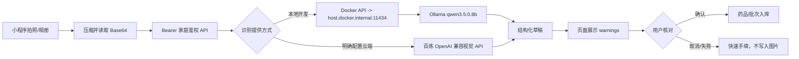

# 药盒照片识别：本地优先的提供方式

Jovi 希望减少录入操作并优先使用本机 RTX 4070 SUPER。当前选型为：小程序拍照 → 家庭鉴权 API → 本机 Ollama `qwen3.5:0.8b` → 结构化草稿 → 人工核对后保存。图片不在本轮持久化，数量和个人剂量不由模型推断。识别失败时保留名称最少手填路径。

## 固定技术路线 v1

当前默认配置：

| 配置 | 本地值 | 说明 |
| --- | --- | --- |
| `MEDICINE_RECOGNITION_PROVIDER` | `ollama` | 本地测试默认值；云端必须显式改为 `dashscope` |
| `OLLAMA_BASE_URL` | `http://host.docker.internal:11434` | 只供本机 Docker 访问，不用于 ECS |
| `OLLAMA_MODEL` | `qwen3.5:0.8b` | 当前 RTX 4070 SUPER 上已验证的稳定视觉模型 |
| Ollama 请求 | `/api/chat`，`stream:false`，`format:json` | `num_ctx=2048`、`num_batch=128`，只要求药品字段 JSON |
| 图片边界 | JPEG/PNG，Base64，≤4 MB，检查文件头和结束标记 | 损坏或截断图片在模型调用前返回 400 |

接口固定为 `POST /api/v1/recognitions/medicine`。请求体是 `{ imageBase64, mimeType }`；返回 `draft`、`warnings` 和 `requiresConfirmation: true`。识别端点要求登录且必须属于家庭，不创建数据库记录，不保存原图，不从照片推断库存数量、个人剂量或服用建议。页面可以补拍包装另一面；第二次识别只补空字段或未知有效期，保留用户已经修改的值。

模型适配器只在服务端运行。微信 AppSecret、百炼 API Key 和未来其他模型密钥不能进入小程序包、图片草稿或日志。本地 Ollama 不可用时返回可见错误并保留手工录入；系统不会自动把家庭照片转发到云端。云端切换必须由部署者显式设置 `MEDICINE_RECOGNITION_PROVIDER=dashscope` 并配置服务端密钥。

## 本机证据与限制

- `nvidia-smi` 实测 RTX 4070 SUPER 显存 12282 MiB；本机 Ollama 有 `qwen3.5:0.8b`（约 1 GB）、`4b`（3.4 GB）和 `9b`（6.6 GB）。[Ollama 官方模型页](https://ollama.com/library/qwen3.5/tags)标示它们支持图像输入。
- 家庭药箱 Docker API 能从 `host.docker.internal:11434` 访问本机 Ollama；容器显式选择 `MEDICINE_RECOGNITION_PROVIDER=ollama` 和 `OLLAMA_MODEL=qwen3.5:0.8b`。该地址只用于本机 Docker。不要把 Ollama 服务端口开放到公网。
- 当前系统核查发现 Ollama 监听 `:::11434`，Windows 防火墙对其有 Public 入站 Allow 规则；尚未验证外网是否可达，也未调整规则。仅用合成图进行本地测试；真实家庭药盒照片前须收紧访问范围。
- 合成药盒正面 PNG：0.8B 模型在 `num_ctx=2048`、`num_batch=128` 下约 12 秒返回名称、规格、厂家、批准文号、批次和年月精度有效期。4B 模型此前在图像编码阶段出现 CUDA 内存分配失败并返回 500，因此本地默认切换到 0.8B；同一合成图片从开发者工具实际请求后返回 HTTP 200，约 4.9 秒。合成排版简单，尚不能代表真实药盒准确率。
- 本机路径没有按 Token 计费，代价是显卡功耗、加载时间和电脑须开机。远端 ECS 为 2 vCPU／2 GiB 且没有该显卡，不能直接沿用本机 Ollama 地址。
- 本机 Ollama 不可用时返回可见错误并保留快速录入；不会自动把照片转发到云端。只有部署者显式选用 `dashscope` 并配置服务端密钥后，照片才会交给百炼。

## 故障记录与排查顺序

2026-09-27 的第一次设备识别请求到达 API，但 `qwen3.5:4b` 的视觉 runner 在图片编码阶段记录 `cudaMalloc failed` 与 `GGML_ASSERT(ctx->mem_buffer != NULL)`，API 返回 503。排查顺序固定为：

1. 看 API 日志中 `/api/v1/recognitions/medicine` 的 HTTP 状态和 `reason`。
2. 看 `docker compose ... exec api` 是否能访问 `http://host.docker.internal:11434/api/tags`。
3. 看 `ollama ps`、GPU 显存和 `server.log`，区分模型 OOM、模型不存在、响应 JSON 错误和图片格式错误。
4. 先换已验证的小模型与较小上下文，再考虑 CPU OCR 或云端；不要把本地服务端口暴露到公网，也不要自动把照片转发到云端。

这次切换到 `qwen3.5:0.8b` 后，同一合成药盒图返回 HTTP 200；数据库 medicines/batches 仍为 0，证明识别结果保持草稿状态，未绕过人工确认。

## 验收边界

- `apps/api/test/recognitions.test.mjs`：鉴权、格式限制、草稿不写库、百炼/Ollama 适配器及安全 503。
- `apps/api/test/medicine-entry-validation.test.mjs`：未知数量与零、非法小数/尾缀、无效日期与闰日。
- 当前已验证：本地 Docker、真实微信登录、合成图片、Ollama 本地提供方式、HTTP 200 草稿返回。
- 尚未验证：真实家庭药盒准确率、真机相机、ECS 上的 CPU OCR 或云端视觉、Ollama 入站规则收紧后的真机流程。

## 轻量 OCR 与远端候选

[RapidOCR](https://github.com/RapidAI/RapidOCR) 配合 [ONNX Runtime CPU](https://github.com/RapidAI/RapidOCRDocs/blob/main/docs/install_usage/rapidocr/how_to_use_infer_engine.md) 可在本机离线读取药盒印刷文字，无模型 API 费用；[PaddleOCR PP-OCRv5](https://www.paddleocr.ai/main/en/version3.x/algorithm/PP-OCRv5/PP-OCRv5.html)也支持中文。它们产出文字，还需规则或小模型抽取药名／有效期，并保留人工核对。ECS 2 GiB 下的内存和延迟尚未实测，不能把它标记为远端可用。

## 云端备用价目（2026-09-27 官方页面）

| 图片能力模型 | 输入／输出价格，均为每百万 Token | 来源 |
| --- | --- | --- |
| 百炼 `qwen3-vl-flash`，北京区域，单次输入 ≤32K | ¥0.15／¥1.50 | [阿里云](https://help.aliyun.com/zh/model-studio/qwen3-vl-flash) |
| DeepSeek `deepseek-flash`，非高峰缓存未命中 | $0.15／$0.60；高峰 $0.30／$1.20 | [DeepSeek 价格](https://api-docs.deepseek.com/quick_start/pricing/)、[图片能力](https://api-docs.deepseek.com/guides/vision/) |
| 小米 `MiMo-V2.5`，缓存未命中 | $0.14／$0.28 | [小米官方文档](https://platform.xiaomimimo.com/docs/zh-CN/integration/roocode) |
| MiniMax `M3`，≤512K 输入档，页面五折价 | $0.30／$1.20 | [MiniMax 价格](https://platform.minimax.io/subscribe/token-plan?tab=api-enterprise) |

以上为各自标价和币种，并非每张照片固定价；不同模型对图片尺寸与 Token 的计算方式不同。百炼为当前已核实的低价云端基线，最终需用同一批真实药盒照片比较字段准确率、耗时和实际用量。远端部署前选择经验证的 CPU OCR 或云端备用方式；不让云服务器依赖家庭电脑的公网模型端口。
